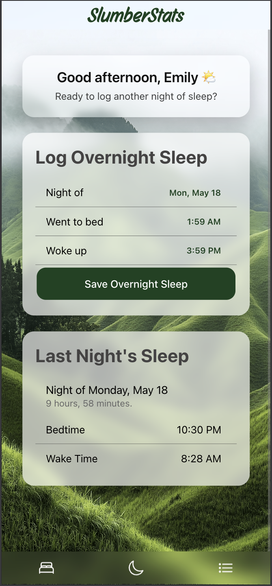
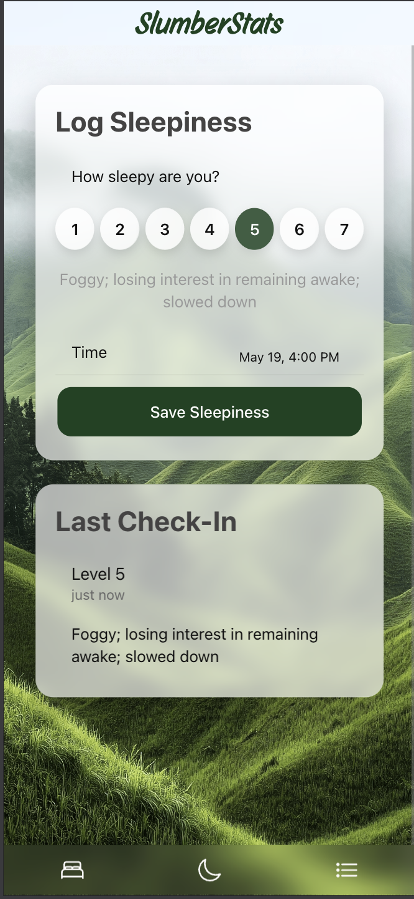
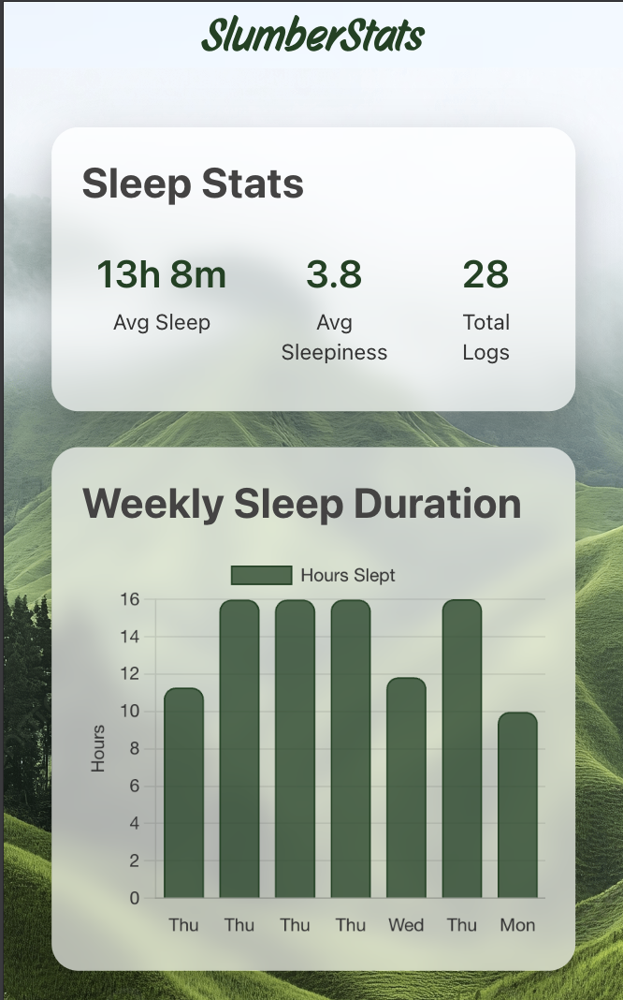
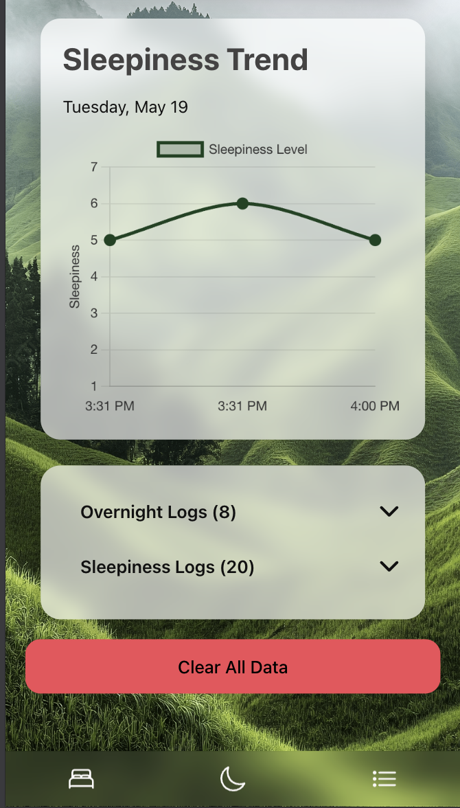
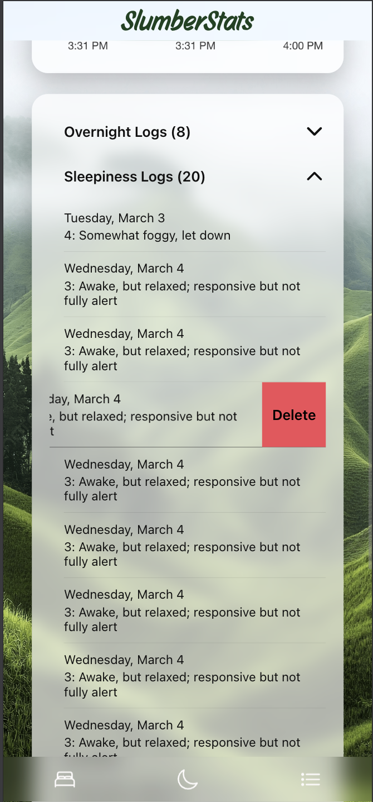

# SlumberStats

SlumberStats is a mobile sleep tracking application built with Ionic and Angular. Users can log overnight sleep, track daytime sleepiness using the Stanford Sleepiness Scale, visualize trends through interactive charts, and persist data locally using browser storage.

## Features

- Overnight sleep logging
- Daytime sleepiness tracking
- Persistent local storage using localStorage
- Interactive sleep analytics charts with Chart.js
- Swipe-to-delete log interactions
- Clear-all data management
- Mobile-focused glassmorphism UI
- Input validation and error prevention
- Collapsible log sections for cleaner navigation

## Technologies Used

- Ionic
- Angular
- TypeScript
- Chart.js
- HTML/CSS/SCSS
- localStorage API

## Screenshots


### Home Page


### Sleepiness Logging


### Sleep Statistics Graph


### Sleepiness Trend Graph


### Swipe-to-Delete Logs



## Running the Project

```bash
npm install
ionic serve